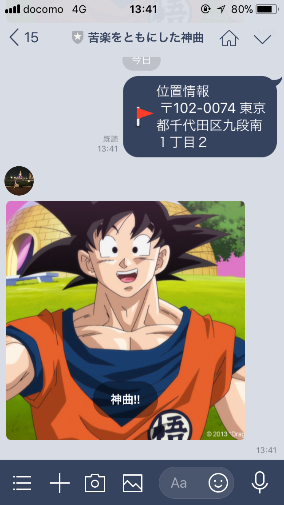

# 概要

東京マラソンでランニング中に聞いた曲を記録する

# 挙動

- LINEBOTにLINEから直接位置情報を送信する

- 送信された郵便番号と住所がLocationｓテーブルに保存される

- その後BOTからspotify　apiを実装したサイトのリンクが返ってくる

- 認証後,[spotifyのapi](https://developer.spotify.com/web-api/web-api-personalization-endpoints/get-recently-played/)を使って、直近聞いた曲をLocationと紐付いて、Songs　テーブルに保存される

# image

.png)

# 使用技術

- Ruby Version 2.3.1

- Rails Version 5.4.1

- [Line Bot](https://github.com/line/line-bot-sdk-ruby)

- [Spotify Api](https://github.com/guilhermesad/rspotify)

- heroku
